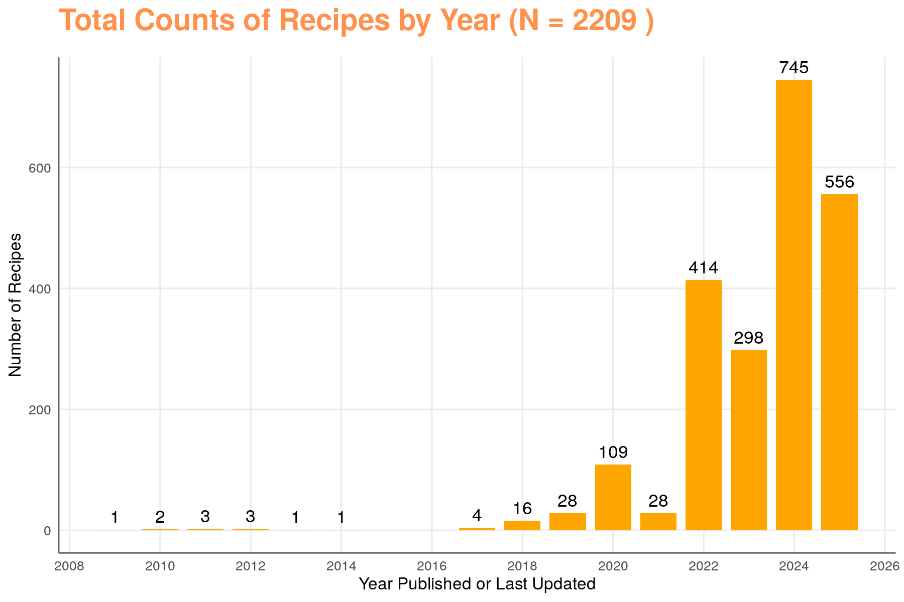
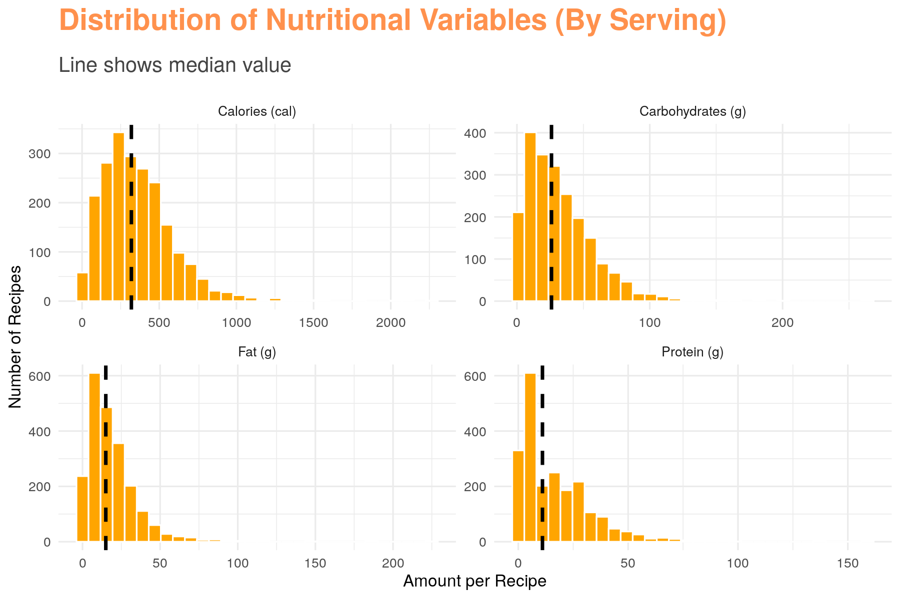
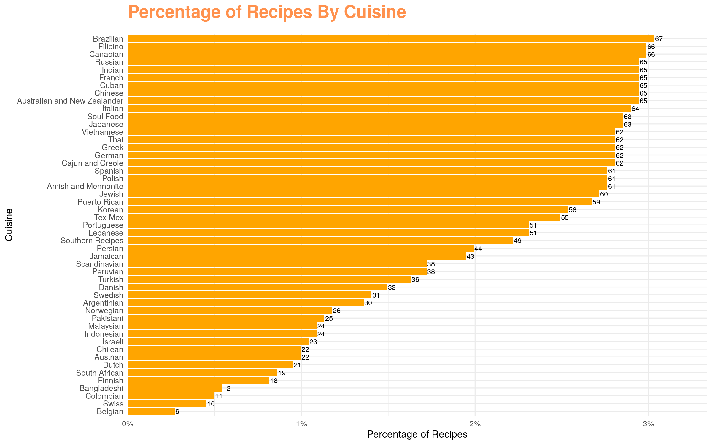
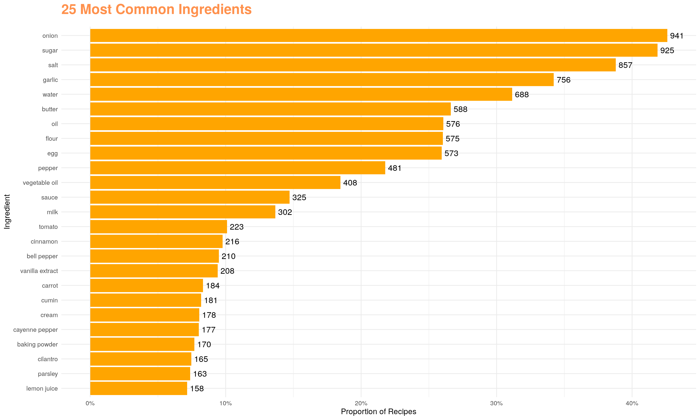
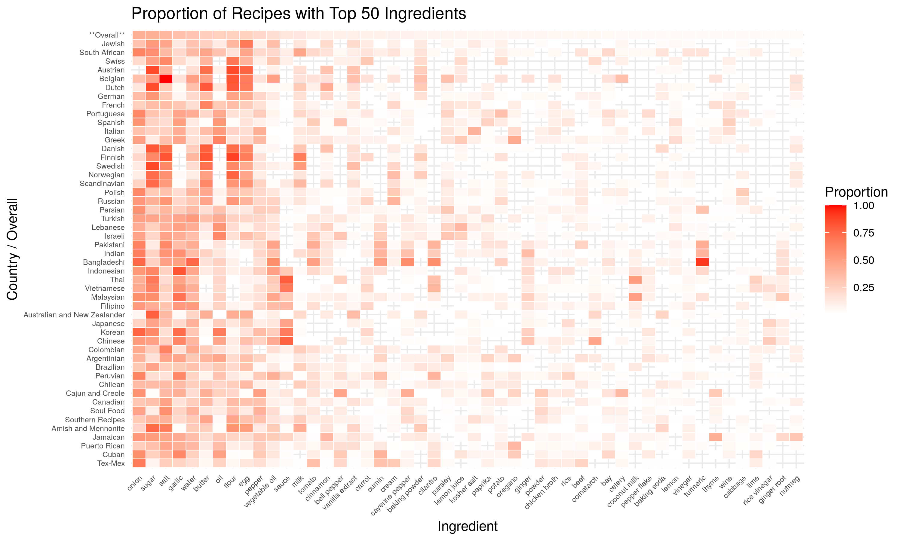
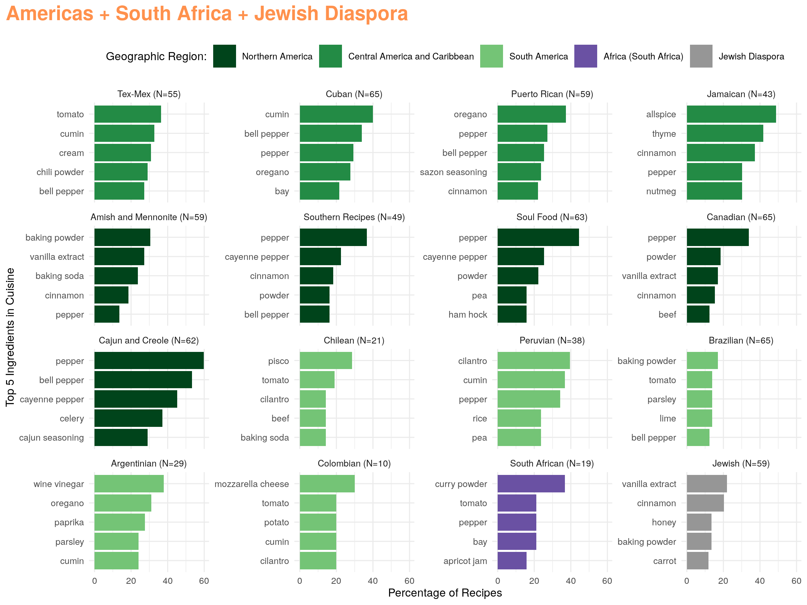
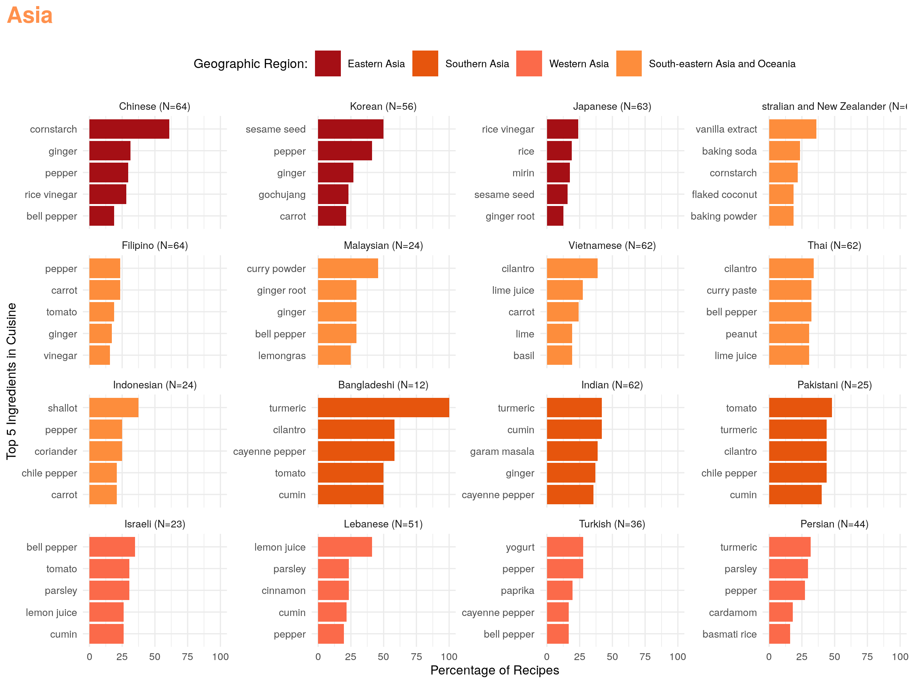
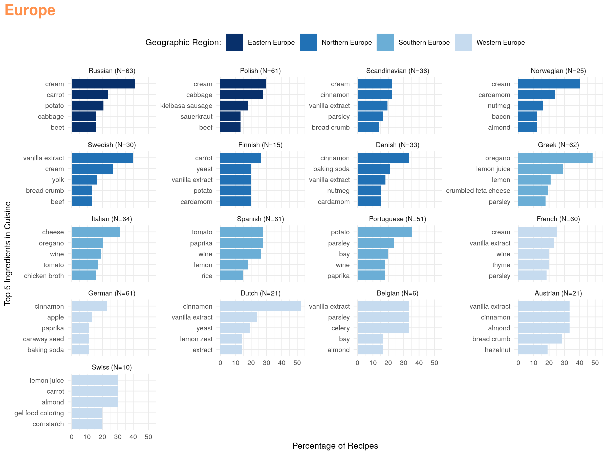
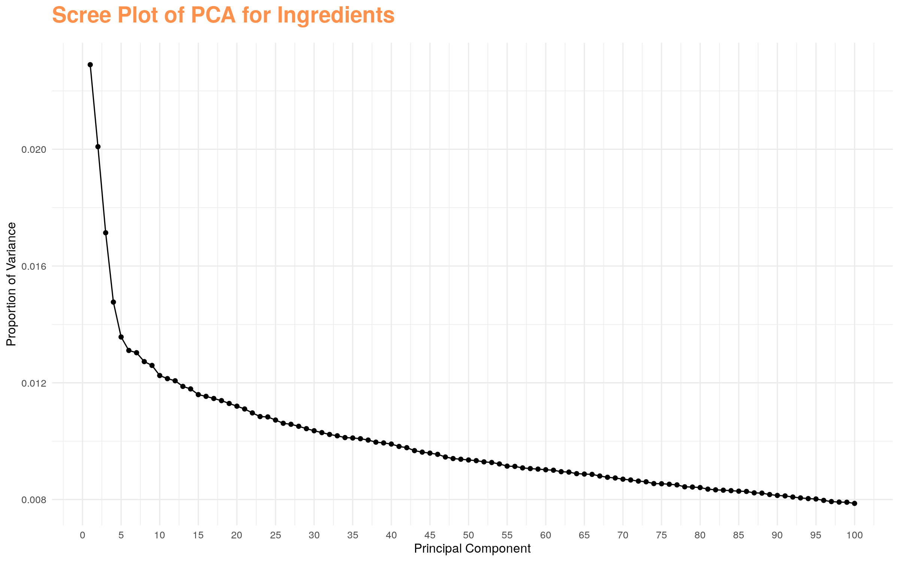

```{r init, warning=FALSE, error=FALSE, echo=FALSE,message=FALSE}
source("00_init.R")
```

# Introduction
```{r png, fig.align="center",echo=FALSE}
    
```

## Allrecipes.com

If you've ever searched online for a recipe or asked "what should I make for dinner" in a search engine, one of the results is most likely from allrecipes.com.

Allrecipes.com is recipe-sharing platform with over 100,000 recipes and 60 million users globally. Users can submit their own recipes as well as interact with other users by commenting, reviewing, or rating recipes. Allrecipes is unique as it is a public forum for recipes and a community for anyone who wants to cook, rather than a carefully curated blog. You can find family heirlooms like [Jewish Grandma's Best Beef Brisket](https://www.allrecipes.com/recipe/103067/jewish-grandmas-best-beef-brisket/) or simple recipes like these [basic crepes](https://www.allrecipes.com/recipe/16383/basic-crepes/).

In addition to being a great resource when you're in a cooking rut, it has a trove of data on each page. So much so, that [Brian Mubia](https://cran.r-project.org/web/packages/tastyR/index.html) took notice and decided to create the tastyR package.

## tastyR package

The tastyR package contains two datasets, allrecipes and cuisines. For this project, we'll dive into cuisines - a dataset containing over 2,000 recipes from allrecipes with information on ingredients, cuisine, nutrition, reviews, and ratings.

## Analysis Plan

After reviewing the cuisines dataset, I was most interested in two components: the cuisine variable, which closely parallels country of origin, and the ingredients variable. We often group country's cuisines into broader categories by geographic location — for example, Italy, Greece, and Turkey are commonly considered Mediterranean food. I was curious to see whether that intuition holds up based on ingredient usage or if we see that geographically distant cuisines have more in common than we might have assumed.

To help guide the project, I came up with some questions to try and answer.

-   What are the most common ingredients overall and by cuisine?
-   Can we visualize recipes with similar ingredient profiles by using t-SNE?
-   Are cuisines with similar ingredient profiles geographically close?

To answer these questions, we will:

1.  Produce histograms to display common ingredients.
2.  Use PCA for dimensionality reduction.
3.  Use t-SNE to visualize recipes with similar ingredient profiles.
4..  Use the UN Geoscheme to define geographic regions and visually group recipes.

# Preparation

Before diving into the data analysis, I want to go over the contents of the dataset,data cleaning steps and lastly,how ingredients were tokenized.

## Dataset Contents

```{r contents, message=FALSE, warning=FALSE, echo=FALSE}
library(knitr)
library(dplyr)
load("results/tables/contents.RData")
df <- summary_table %>% filter(variable != "region" & variable != "continent" & variable != "X") %>% select(-stats)
kable(df, align = c("l","l","l"),caption = "Table 1. Summary of Cuisine Dataset")
```

The cuisines dataset contains 2,218 records with 17 different variables, described above. Records are uniquely identified by name and author.

Ingredients are comma-delimited with measurement and units but not standardized. Fat, carbs, and protein are measured in grams. Ratings are on a 1-star to 5-star rating scale.

Something to note is that total ratings and reviews are erroneously truncated to the thousands, unless there were less than 1000 ratings total. This was discovered when creating frequency tables and confirmed online ([Github - TidyTuesday Data](https://github.com/rfordatascience/tidytuesday/blob/1aef86fe34cc24396a350985dfb3288e31117851/data/2025/2025-09-16/readme.md?plain=1)).

In the exploratory data analysis, we will cover some basic descriptive statistics on some of these variables to give us a general idea of the recipes we are working with.

## Data Cleaning

For data cleaning, the following steps were taken:

-   Removed records with missing values in critical fields (name, author, cuisine, and ingredients)
-   Identified and removed duplicate recipes by name:
    -   Exact duplicates by name were identified
    -   Similar duplicates by name were identified by using the functions `stringdistmatrix`,`hclust`, and `cutree`. The threshold for `cutree` was 0.05 and duplicates were manually reviewed to ensure that they were similar enough to be considered the same and the threshold was appropriate.
    -   The recipe with the highest number of ratings was kept out of the pair

Outliers in numeric variables were not examined as these variables will be not used in the main analysis. After data cleaning, 9 records were removed from the initial dataset.

## Ingredient Standardization

Below shows example of what the raw ingredients variable look like.

```{r ingred_ex, message=FALSE, warning=FALSE, echo=FALSE}
df <- read.csv("data/cuisines.csv", header = TRUE) %>% 
      select(ingredients) %>% 
      slice_head(n=5)
print(df)
```

As you can see, it is contains a lot of information, represented in different forms. For example, there is additional text within parentheses as well as measurements and method of preparation (ex. "chopped").

For the purposes of PCA and t-SNE, we will standardized and tokenized the ingredients so we get one row per ingredient per recipe, with no measurement, unit, or additional information. Adjectives that are unnecessary such as small,large etc. will be removed.

The following steps were taken:

-   Standardized text by trimming whitespace, removing percentages, parentheses, and non‑ASCII characters
-   Split multi‑ingredient strings into separate rows
-   Identified and removed raw units and numeric measurements using regex patterns
-   Removed prepositions (e.g., “with”, “or”, “for”, “from”, “in”) and adjectives
-   This was done using NLP annotation with UDPipe to add part‑of‑speech tags
-   Standardized plural forms of the food to the singular version
-   Identified and rectified misspellings by using the functions `stringdistmatrix`,`hclust`, and `cutree` like above.The threshold for `cutree` was 0.10 and clusters were manually reviewed to ensure that they were true misspellings.

Standardizing the ingredients was not a trivial effort. Given the amount of recipes and ingredients, it is not guaranteed that every case was accounted for in this step. 

After these steps, this is what the ingredients column became:

```{r ingred, echo=FALSE}
df <- read.csv("data/ingredients.csv", header = TRUE) %>% 
      select(food) %>% 
      slice_head(n=20)
print(df)
```

In the data analysis section, we will discuss the top ingredients.

# Data Analysis

## Descriptive Analyses

### Features
To get a sense of the data we are working with, I produced some basic graphs and a table with descriptive statistics on most of the variables.

```{r by_year, fig.align="center",echo=FALSE}
    
```

We can see above that we are dealing with recipes mostly from the last 5 years, so they should reflect current food trends.

```{r nutrients, fig.align="center",echo=FALSE}
    
```

The above graphs display the spread of nutritional variables. With 50% of recipes having less than 11 grams of protein, we may have more recipes that are vegetarian rather than meat-based. The median value of calories is about 320 and so the recipes are most likely moderate and not overly indulgent.

The table below includes a more numerical look at the raw variables if intrigued. 

```{r table1, message=FALSE, warning=FALSE, echo=FALSE}
load("results/tables/table1.RData")
table2 <- table1 %>% filter(variable != "region" & variable != "continent" & variable != "country" & variable != "Cuisine" & !is.na(statistics))
kable(table2, align = c("l","l","l"),caption = "Table 2. Descriptive Statistics for Variables")
```

Next, we will look at the two critical variables for this analysis - cuisine and ingredients. Below are graphs detailing the proportion of cuisines by recipe and the most common ingredients.

There are over 40 different cuisines, most of which are directly related to a single country with the exception of a few such as Jewish, Cajun and Creole, Amish and Mennonite, and Southern Recipes. The largest percentage of recipes comes from Brazil and Filipino while the lowest is Belgian. There are several missing cuisines on this dataset and it is a limitation in this analysis. For example, we do not have any data on countries in Africa besides South Africa.
```{r cuis, fig.align="center",echo=FALSE}
    
```

Returning to the top ingredients, after standardizing and tokenizing, there were over a thousand uniquely named ingredients. I calculated the frequency of the ingredient appearing in the 2,209 recipes and graphed the proportion of recipes with the top 25 ingredients. 
```{r top25, fig.align="center",echo=FALSE}
    
```

The top 25 ingredients are not very surprising and make sense intuitively. I am a little surprised that onion is first compared to salt, sugar, and water, though. Cinnamon and vanilla extract were also in the top 25 so that suggests to me that there are several bakery recipes like cookies or cinnamon rolls.

### Heatmap of Top 50 Ingredients
 Now to figure out how ingredient usages breaks down by cuisine, I produced a heat map and added 25 more ingredients to make it a little more interesting.
 I organized the cuisines on the y-axis by the UN Geoscheme for regions and when a cuisine was not a country, I grouped it with the region with which the cuisine is typically associated with.The only cuisine I did not do for was Jewish cuisine since their cuisine covers multiple areas and are dispersed globally. We will use these groupings for visualization with T-SNE later.
 Some things that stood out to me were:
 
1. High proportion of sugar, salt,flour and eggs in the Northern European countries - sounds like bakery recipes such as bread or cookies.
2. Distinctive ingredients are popular in the countries you'd expect like tumeric in the South Asian countries and coconut milk in South-eastern countries
3. Low proportion of garlic in Northern and some Western European countries

```{r heat, fig.align="center",echo=FALSE}
    
```

### Top 5 Ingredients by Cuisine
For fun, I also created histograms of the top 5 ingredients in each country after removing the top 10 ingredients like salt and sugar. The top 5 ingredients made intuitive sense to me but I could also see that in the recipes included in this dataset are not representative of an entire cuisine, but rather more popular recipes.


```{r top5, fig.align="center",echo=FALSE}
    
    
    
```

## Data Science Analysis
Below outlines the steps to take the recipes' ingredients and see if we can see any structure or clusters through t-SNE.
### Data Set Up
- Created a binary matrix where each row represents a recipe and each column represents an ingredient
- Marked presence of an ingredient with `1` and absence with `0`
- Ensured each recipe–ingredient pair is unique
- Converted the table into a matrix and scaled the matrix for analysis

### Principal Component Analysis (PCA)
- Ran PCA using the function prcomp_irlba, since we had over 1,000 ingredients and sparse matrices, to reduce the high-dimensional ingredient matrix into 100 components (20% variance)
- Note: at first, I ran the normal prcomp function and it took about 670 PCs to capture 80% variance (but prcomp_irlba would not finish running with that many PCs, given it is computationally expensive).
- Calculated variance explained by each component
- Produced a scree plot to visualize variance explained by principal components
```{r pca_s, fig.align="center",echo=FALSE}
        
```


### t-SNE Embedding
- Applied t-SNE on the PCA results to map recipes into two dimensions
- Generated coordinates (`X`, `Y`) for each recipe in the t-SNE plot
- Merged these coordinates with the crosswalk table to attach recipe names, regions, and URLs

### Plotting
- Built a Plotly scatter plot, coloring points by region and listing countries under each region in the legend.  
- Each recipe point includes hover text and a link, so you can explore cuisines interactively.  
- A click handler was added to open recipe URLs in a browser  

```{r, results='asis', message=FALSE, echo=FALSE}
cat('<iframe src="results/plots/tsne_recipes.html" width="100%" height="600" frameborder="0"></iframe>')
```
# Discussion
To see if we can visualize recipes with similar ingredient profiles, we used PCA to reduce dimensionality and applied t-SNE to visualize local neighborhoods. You can see that Asian recipes, particularly, Southern, Eastern, and South-east Asian, are located near each other. You can also see a couple of small North American and South American clusters. European recipes are spread out. One thing I did notice is that sweeter recipes were located by one another, additionally so were cocktail/drink recipes. I think the t-SNE might be showing us flavors or types of meals like desserts. If that is the case, it would explain why we see those Asian recipes together because there was more homogeneity in the type of recipes when I went through the names. Most of them were savory dinner recipes. The other cuisines, particular those in Europe, seem to have more of a balance with both savory and sweet dishes with less regionally-specific ingredients. 


# Limitations
There are some limitations that I want to acknowledge. The cuisines dataset is a relatively small sample that does not capture global cuisine. Additionally, since allrecipes.com is a U.S. owned company, we are going to have more recipes that for North American and English‑speaking audiences. For example, recipes labeled "Chinese" for their cuisine may be American-ized versions and don't accurately represent traditional cuisine. Lastly, food often crosses borders and having one cuisine tagged to it ignores the impact of colonization, immigration, fusion and globalization.


# Next Steps
If I were to continue this project, I'd like to do the following:

-   Web scrape more recipes to get a better variety and representation of data and add meal as a variable
-   Find a better way to standardize and tokenize ingredients
-   Tag ingredients by dominant flavor (salty,sweet,bitter,umami, and sour)
-   Repeat PCA and tSNE to see if there is clustering by meal,flavor,region
-   Use a clustering method to identify clusters
-   Create a Shiny app to find recipes by meal,flavor, and ingredients